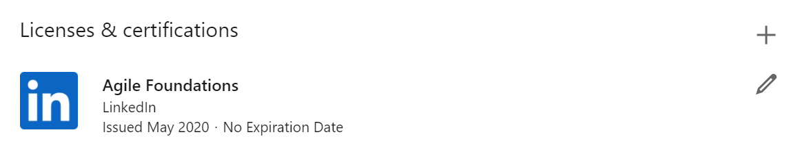

# Week 1: Version control and HelloWorld.html

## Summary
This is the first week of the IC1 web development segment.  The week focuses on git version control and learning the basics of HTML. The structure of the first week is spending half the time watching videos and then the other practicing alongside the presenter.

This is a proven method for learning new programming concepts, especially when self-studying.

Future lessons are more project or activity oriented. Next weeks, for example, is project based.  Apprentices will combine their learning in HTML, CSS, Git, and GitHub to deploy their first webpage.

The first week objectives are below.

### Technical Objectives
- Set up a development environment 
- Understand Git commands, workflow and version control best practices
- Introduction to building HTML sites

## Estimated time
- 15m - Installing VS Code
- 4h 30m - Git Essential Training
- 5h - HTML Essential Training

## Modules

### Install Visual Studio Code
In this module you will download and install VS Code.

Module: [Install VS Code](https://github.com/Leap-Internal-Program/install-vscode/blob/master/install-vscode.md)

---
### Git Essential Training
Learn how to use Git (the most popular and open-source version control software) to manage source code.

Module: [Git Essential Training](https://github.com/Leap-Internal-Program/git-essential-training/blob/master/git-essential-training.md)

---
### HTML Essential Training
Learn basics of HTML (HyperText Markup Language) for building web sites.

Module: [HTML Essential Training](https://github.com/Leap-Internal-Program/html-essential-training/blob/master/html-essential-training.md)

---
## Presentation
There is no class presentation this week. 

## Project
There is no project to turn for week 1.  Instead, add both LinkedIn Learning certificates on the course you completed to the *License and certification* section of the your LinkedIn Page.  *You may choose to share that you completed this learning on your network.*

Use the following instructions: [Add Learning Certificates of Completion and Skills to Your LinkedIn Profile](https://www.linkedin.com/help/linkedin/answer/71929/adding-linkedin-learning-courses-and-skills-to-your-profile).

